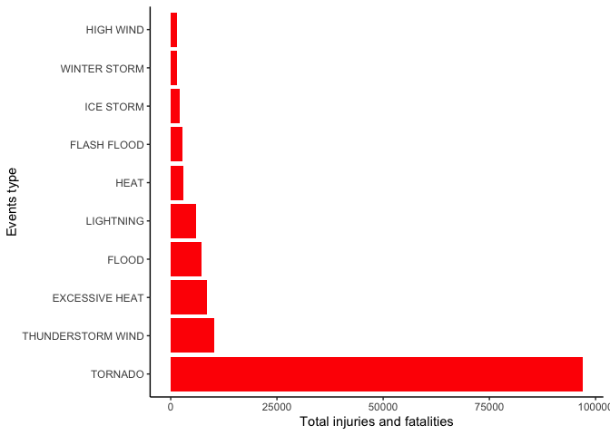
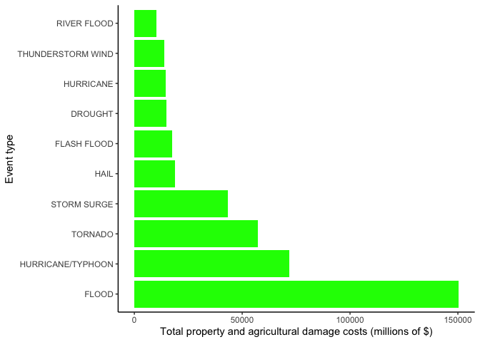

# An analysis into the events that cause the highest population and economic damage within the United States.

## Summary

Natural disasters can causes injuries and fatalities to the poplulation. They can also create economic consequences due to damage to property and agriculture. Between 1950 and 2011, the National Climatic Data Center has been recording how such events have impacted the United States. This study has analysed such data, and produced the following conclusions: <b>tornadoes</b> are the most harmful event to the population, and <b>floods</b> are the most harmful event to the economy. 


## Data Processing

The packages to be used throughout the analysis are loaded. 


```r
library(dplyr)
library(ggplot2)
```

The data was retrieved from the U.S. National Oceanic and Atmospheric Administration's storm database, which contains data produced by the the National Climactic Data Center. The data is in the form of a comma-separated-value file (.csv) compressed via the bzip2 (.bz2) algorithm to reduce its size. It does not need to be unzipped as the read.csv function can read .bz2 files. 


```r
fileUrl <- "https://d396qusza40orc.cloudfront.net/repdata%2Fdata%2FStormData.csv.bz2"
filename <- "repdata_data_StormData.csv.bz2"

if(!file.exists(filename)) {
    download.file(fileUrl,destfile=filename,method="curl")
}
Data <- read.csv("repdata_data_StormData.csv.bz2", header = TRUE)
```

There are 37 variables within the data, the ones to be used within this study are as follows:

<p>EVTYPE: The type of event/natural disaster. <br>
FATALITIES: The number of deaths. <br>
INJURIES: The number of injuries. <br>
PROPDMG: The monetary cost in damages to property in dollars. <br>
PROPDMGEXP: The exponent value for the property damage. <br>
CROPDMG: The monetary cost in damages to agriculture in dollars. <br>
CROPDMGEXP: The exponent value for the agriculutre damage. <p>

There are 48 official event types (EVTYPE) according to the Storm Data Documentation. However, there are nearly 1000 unique EVTYPES within the data. This is due to misspellings, differing capitalisations, and such. The total clean up of the data would be too time consuming, and perhaps beyond the scope of this assignment. I have included an example of how the data could be cleaned. This will be a limitation to consider when looking at the results of this study.


```r
Data$EVTYPE<- toupper(Data$EVTYPE)
Data$EVTYPE[grep("TSTM WIND", Data$EVTYPE)] <- "THUNDERSTORM WIND"
Data$EVTYPE[grep("THUNDERSTORM", Data$EVTYPE)] <- "THUNDERSTORM WIND"
```

The PROPDMGEXP and CROPDMGEXP variables contain letters to indicate their exponents, these are: h = 10^2, k = 10^3, m = 10^6 and b = 10^9. The exponents represented by -, + and ? are not going to be considered here. This is not useful for data analysis as you cannot perform the required calculations with these letters. To solve this, any instance of such letter within the variable is replaced with its respective numerical value, using the grep function. The toupper function is used as there are instances in which differing capitalisations are used. The variables are converted to numeric from character to allow for the future calculations. 


```r
Data$PROPDMGEXP<- toupper(Data$PROPDMGEXP)
Data$PROPDMGEXP[grep("H", Data$PROPDMGEXP)] <- "100"
Data$PROPDMGEXP[grep("K", Data$PROPDMGEXP)] <- "1000"
Data$PROPDMGEXP[grep("M", Data$PROPDMGEXP)] <- "1000000"
Data$PROPDMGEXP[grep("B", Data$PROPDMGEXP)] <- "1000000000"
Data$PROPDMGEXP <- as.numeric(Data$PROPDMGEXP)

Data$CROPDMGEXP<- toupper(Data$CROPDMGEXP)
Data$CROPDMGEXP[grep("H", Data$CROPDMGEXP)] <- "100"
Data$CROPDMGEXP[grep("K", Data$CROPDMGEXP)] <- "1000"
Data$CROPDMGEXP[grep("M", Data$CROPDMGEXP)] <- "1000000"
Data$CROPDMGEXP[grep("B", Data$CROPDMGEXP)] <- "1000000000"
Data$CROPDMGEXP <- as.numeric(Data$CROPDMGEXP)
```

The EVTYPE is grouped, and the total number of injuries and fatalities for each EVTYPE is calculated using a series of dplyr functions. The data is sorted by descending of the total. The top ten events are then stored.   


```r
Population_Damage <- Data %>% 
    group_by(EVTYPE) %>% 
    summarise(Total_Fatalities = sum(FATALITIES, na.rm = TRUE), 
              Total_Injuries = sum(INJURIES, na.rm = TRUE)) %>%
    mutate(Total_Population_Damage = Total_Fatalities + Total_Injuries) %>% 
    arrange(desc(Total_Population_Damage)) %>% 
    slice(1:10)
head(Population_Damage)
```

```
## # A tibble: 6 × 4
##   EVTYPE            Total_Fatalities Total_Injuries Total_Population_Damage
##   <chr>                        <dbl>          <dbl>                   <dbl>
## 1 TORNADO                       5633          91346                   96979
## 2 THUNDERSTORM WIND              754           9544                   10298
## 3 EXCESSIVE HEAT                1903           6525                    8428
## 4 FLOOD                          470           6789                    7259
## 5 LIGHTNING                      816           5230                    6046
## 6 HEAT                           937           2100                    3037
```

This is then repeated for the economic damage, however, firstly, the DMG and EXP variables are multiplied to create a single value. The mutate function from dplyr is used here. 


```r
Economic_Damage <- Data %>% 
    mutate(Total_Prop_Dmg = PROPDMG * PROPDMGEXP) %>% 
    mutate(Total_Crop_Dmg = CROPDMG * CROPDMGEXP) %>%
    group_by(EVTYPE) %>% 
    summarise(Total_Prop = sum(Total_Prop_Dmg, na.rm = TRUE), 
              Total_Crop = sum(Total_Crop_Dmg, na.rm = TRUE)) %>%
    mutate(Total_Economic_Damage = Total_Prop + Total_Crop) %>% 
    arrange(desc(Total_Economic_Damage)) %>% 
    slice(1:10)
head(Economic_Damage)
```

```
## # A tibble: 6 × 4
##   EVTYPE               Total_Prop Total_Crop Total_Economic_Damage
##   <chr>                     <dbl>      <dbl>                 <dbl>
## 1 FLOOD             144657709800  5661968450         150319678250 
## 2 HURRICANE/TYPHOON  69305840000  2607872800          71913712800 
## 3 TORNADO            56937160991   414953110          57352114101 
## 4 STORM SURGE        43323536000        5000          43323541000 
## 5 HAIL               15732267370  3025954450          18758221820 
## 6 FLASH FLOOD        16140812087. 1421317100          17562129187.
```

## Results 

To create visualisations of the data, the ggplot function is used. Barplots are the selected plots here. 


```r
ggplot(data=Population_Damage, aes(x=(reorder(EVTYPE, -Total_Population_Damage)), y=Total_Population_Damage)) +
    geom_bar(stat = "identity", fill = "red") +
    labs(x = "Events type", y = "Total injuries and fatalities") +
    theme_classic(base_family = "Arial") +
    coord_flip() 
```

<!-- -->

<center><b>Figure 1: The top ten events that are the most harmful to the human population in the United States.</b></center>

Figure 1 shows the total injuries and fatalities for each event. It indicates that <u>tornados are the most harmful event to the US population</u>. For clarification, the total injuries and fatalities is the number of people who were injured or died during the event. The total injuries and fatalities is considerably higher for tornado than other events.  


```r
ggplot(data=Economic_Damage, aes(x=(reorder(EVTYPE, -Total_Economic_Damage)), y=Total_Economic_Damage/1000000)) +
    geom_bar(stat = "identity", fill = "green") +
    labs(x = "Event type", y = "Total property and agricultural damage costs (millions of $)") +
    theme_classic(base_family = "Arial") +
    coord_flip() 
```

<!-- -->

<center><b>Figure 2: The top 10 events that are the most harmful to the economy of the United States.</center></b> 

Figure 2 shows the total property and agricultural damage for each event. It indicates that <u>floods are the most harmful event to the US economy</u>, due to floods causing the highest property and agricultural damage costs. The x axis has been reduced by a factor of a million for readability. 

Interestingly, floods cause the most economic damage, and is only ranked four on population damage. Tornadoes cause the most population damage, yet cause the third most economic damage. Further analysis could be done to see how this varies by state, to see which areas require the most support for such events.
